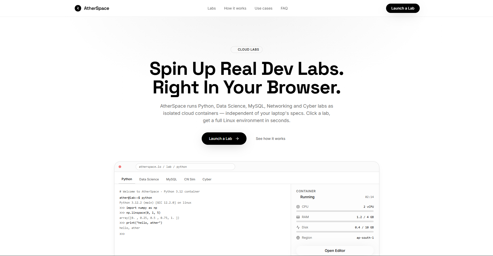
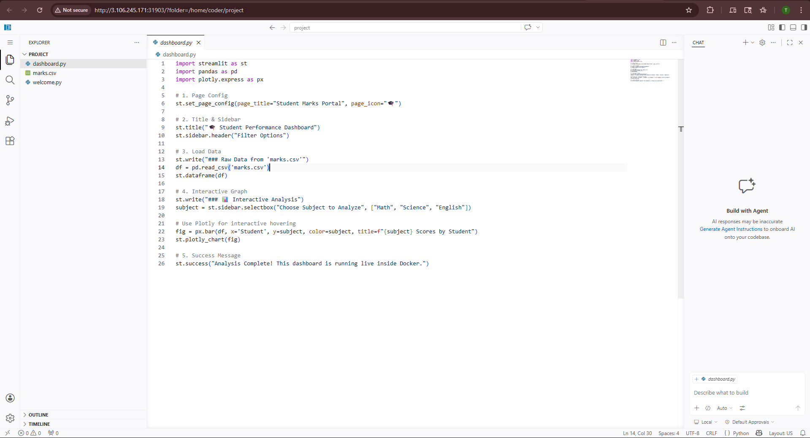

# 🌌 Aetherspace
### *Instant Cloud Labs — No Setup. Just Learn.*

> A Kubernetes-powered Internal Developer Platform (IDP) that gives students browser-based, pre-configured development environments in seconds. No local installs. No config headaches. Just code.

---

## 🔗 Demo & Screenshots

🚀 **Live Demo:** `[Add your deployment URL here]`

| Landing Page | Lab Dashboard | Active Lab Session |
|---|---|---|
|  |  |  |

> 📸 *Add screenshots to a `/screenshots` folder in the root of this repo.*

---

## ✨ What Is Aetherspace?

Aetherspace is a cloud lab platform built for universities and bootcamps. A student clicks a button on the web dashboard, and within seconds a fully-loaded containerized lab environment (Python IDE, SQL workbench, Cybersecurity desktop, Data Science notebook, or Networking tools) opens directly in their browser — powered by Kubernetes under the hood.

**Key capabilities:**
- ⚡ One-click lab provisioning via Kubernetes Pods
- 🕐 Automatic session cleanup after 30 minutes (resource safety)
- 🔒 Capacity-capped environment (max 3 concurrent pods on free-tier infra)
- 🌐 Browser-based access — no VPN, no SSH, no client install
- 🧹 Auto-teardown of stale pods and services

---

## 🏗️ Architecture Overview

```
Aetherspace/
├── backend/                    # FastAPI server — Kubernetes orchestrator
│   ├── main.py                 # Core API: spawns & destroys K8s pods
│   └── requirements.txt        # Python dependencies
│
├── frontend/                   # React (Vite + TypeScript) dashboard
│   ├── src/
│   │   ├── components/         # Reusable UI components (shadcn/ui + Radix)
│   │   │   ├── landing/        # Landing page sections (Nav, LabsGrid, CTABanner)
│   │   │   └── ui/             # Core UI primitives
│   │   ├── pages/              # Route-level page components
│   │   ├── hooks/              # Custom React hooks
│   │   └── lib/                # Utility functions
│   ├── index.html
│   └── vite.config.ts
│
└── labs/                       # Dockerfiles for reference & experimentation
    ├── python/                 # VS Code Server + Python environment
    ├── sql/                    # MariaDB + Adminer GUI
    ├── cyber/                  # Kali-style tools + NoVNC desktop (XFCE)
    ├── cn/                     # Computer Networking tools + NoVNC
    └── Data Science/           # JupyterLab + Data Science stack

> 💡 The `labs/` folder contains the source Dockerfiles for reference. You do **not** need to build these — all images are pre-built and publicly available on Docker Hub.
```

---

## 🧰 Tech Stack

| Layer | Technology |
|---|---|
| **Frontend** | React 18, TypeScript, Vite, Tailwind CSS, shadcn/ui, Radix UI |
| **State / Data** | TanStack Query, React Router v6, React Hook Form + Zod |
| **Backend** | Python, FastAPI, Uvicorn |
| **Orchestration** | Kubernetes (K3s / Docker Desktop K8s) |
| **Container Runtime** | Docker |
| **Remote Access** | NoVNC (desktop), Code-Server (IDE), Adminer (DB GUI) |
| **Deployment** | AWS EC2 (auto-detects public IP via metadata service) |

---

## 🚀 Available Labs

All lab images are **pre-built and publicly available on Docker Hub** — Kubernetes will pull them automatically when a lab is launched. No manual `docker build` required.

| Lab | Docker Hub Image | Access Method | Port |
|---|---|---|---|
| 🐍 Python | [`tejaswaroop29/lab-python:v1`](https://hub.docker.com/r/tejaswaroop29/lab-python) | Code-Server (VS Code in browser) | 8080 |
| 🗄️ SQL | [`tejaswaroop29/lab-sql:v1`](https://hub.docker.com/r/tejaswaroop29/lab-sql) | Adminer Web GUI | 8080 |
| 📊 Data Science | [`tejaswaroop29/lab-ds:v1`](https://hub.docker.com/r/tejaswaroop29/lab-ds) | JupyterLab (no token) | 8888 |
| 🛡️ Cybersecurity | [`tejaswaroop29/lab-cyber:v1`](https://hub.docker.com/r/tejaswaroop29/lab-cyber) | NoVNC Desktop | 6080 |
| 🌐 Computer Networks | [`tejaswaroop29/lab-cn:v1`](https://hub.docker.com/r/tejaswaroop29/lab-cn) | NoVNC Desktop | 6080 |

> 🔬 Want to customise a lab? Check the `labs/` folder — each subfolder has the full `Dockerfile` to build and experiment with.

---

## ⚙️ Setup Guide

Aetherspace uses a **split deployment model**:

| Component | Where it runs |
|---|---|
| 🎨 **Frontend** (React) | Your local machine |
| 🧠 **Backend** (FastAPI + Kubernetes) | AWS EC2 instance |

---

### Part 1 — EC2 Instance Setup (Backend + Kubernetes) 🖥️

#### 1.1 Launch an EC2 Instance

- **OS:** Ubuntu 22.04 LTS
- **Instance type:** `m7i-flex.large` (2 vCPU / 8 GB RAM — recommended for running multiple lab pods)
- **Storage:** At least **20 GB** (Docker images take up space)
- **Security Group — open these inbound ports:**

| Port | Purpose |
|---|---|
| `22` | SSH access |
| `8000` | FastAPI backend |
| `30000–32767` | Kubernetes NodePort range (lab access) |

---

#### 1.2 Install Docker on the EC2 Instance

SSH into your instance, then run:

```bash
sudo apt update && sudo apt upgrade -y

# Install Docker
sudo apt install -y docker.io
sudo systemctl enable --now docker
sudo usermod -aG docker $USER

# Re-login or run this to apply group changes without logout
newgrp docker
```

---

#### 1.3 Install Kubernetes (K3s — lightweight single-node)

```bash
# Install K3s (includes kubectl)
curl -sfL https://get.k3s.io | sh -

# Make kubectl usable without sudo
mkdir -p ~/.kube
sudo cp /etc/rancher/k3s/k3s.yaml ~/.kube/config
sudo chown $USER ~/.kube/config
export KUBECONFIG=~/.kube/config

# Verify cluster is running
kubectl get nodes
```

---

#### 1.4 Clone the Repo

```bash
git clone https://github.com/Teja-swaroop141/Aetherspace.git
cd Aetherspace
```

> ✅ No image building needed — all lab images are public on Docker Hub and will be pulled automatically by Kubernetes when a student launches a lab.

---

#### 1.5 Start the Backend Server

```bash
cd Aetherspace/backend

# Install Python dependencies
pip install -r requirements.txt

# Run the FastAPI server (accessible from outside the instance)
python -m uvicorn main:app --host 0.0.0.0 --port 8000
```

> ✅ The backend is now live. Note your **EC2 Public IP** from the AWS console — you'll need it next.
> 
> API docs are available at: `http://<EC2-PUBLIC-IP>:8000/docs`

---

### Part 2 — Frontend Setup (Local Machine) 💻

#### 2.1 Clone the Repo Locally

```bash
git clone https://github.com/Teja-swaroop141/Aetherspace.git
cd Aetherspace/frontend
```

---

#### 2.2 Point the Frontend at Your EC2 Backend

Create a `.env` file inside the `frontend/` folder:

```env
VITE_API_URL=http://<EC2-PUBLIC-IP>:8000
```

> 🔁 Replace `<EC2-PUBLIC-IP>` with the actual public IPv4 address of your EC2 instance.
> Example: `VITE_API_URL=http://13.233.45.67:8000`

---

#### 2.3 Install Dependencies & Run

```bash
# Install dependencies
npm install

# Start the React dev server
npm run dev -- --host
```

> 🌐 Frontend will be accessible at `http://localhost:5173`

---

### Part 3 — Launch a Lab 🚀

1. Open `http://localhost:5173` in your browser
2. Pick a lab (Python, SQL, Data Science, Cyber, or Networks)
3. Click **Launch** — the frontend calls your EC2 backend
4. The backend spawns a Kubernetes Pod on EC2 and returns a URL
5. A new browser tab opens with your live, browser-based lab environment

---

> [!NOTE]
> Labs auto-terminate after **30 minutes** to free up EC2 resources. The backend enforces a max of **3 concurrent pods** by default.

---

## 🔌 API Reference

| Method | Endpoint | Description |
|---|---|---|
| `GET` | `/health` | Health check + host IP |
| `GET` | `/status` | Active pod count / capacity |
| `GET` | `/config` | Returns host IP |
| `POST` | `/start-python-lab` | Spawn a Python lab pod |
| `POST` | `/start-sql-lab` | Spawn a SQL lab pod |
| `POST` | `/start-ds-lab` | Spawn a Data Science pod |
| `POST` | `/start-cyber-lab` | Spawn a Cybersecurity pod |
| `POST` | `/start-cn-lab` | Spawn a Computer Networks pod |
| `DELETE` | `/stop-lab/{pod_name}` | Terminate a specific pod |

---

## 👥 Collaborators

| Role | Profile |
|---|---|
| 👨‍💻 Author & Lead Dev | [@Teja-swaroop141](https://github.com/Teja-swaroop141) |
| 🤝 Collaborator | [@sumans-19](https://github.com/sumans-19) |

---

## 📄 License

This project is open-source. Feel free to fork and adapt for your institution.

---

<p align="center">Built with ☁️ and Kubernetes by the Aetherspace team</p>
